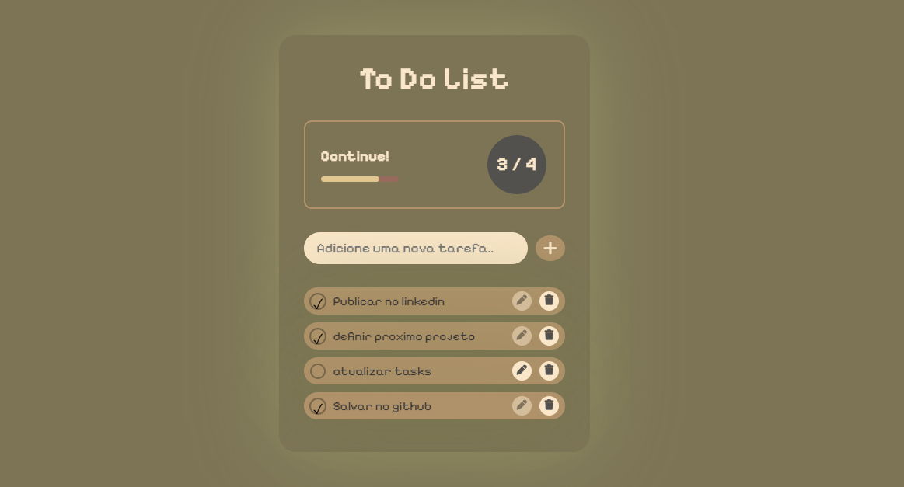

# 📝 To Do List

Um projeto de **lista de tarefas** desenvolvido com **HTML, CSS e JavaScript**.  
Criado como parte da minha meta de desenvolver **1 projeto por semana** para praticar teoria e habilidades de programação.

📸 **Preview:**  
 

---

## 🚀 Funcionalidades
✅ Adicionar tarefas  
✅ Editar tarefas  
✅ Remover tarefas  
✅ Marcar como concluídas  
✅ Barra de progresso dinâmica  
✅ Contador de tarefas finalizadas  

---

## 🎨 Layout
- Fonte: [Pixelify Sans](https://fonts.google.com/specimen/Pixelify+Sans)  
- Interface minimalista com toque de pixel art


---

## 🛠️ Tecnologias usadas
- **HTML5**
- **CSS3**
- **JavaScript (DOM)**

---

## 📌 Como rodar localmente
1. Clone o repositório:
   ```bash
   git clone https://github.com/EdCavalcante/to-do-list.git
